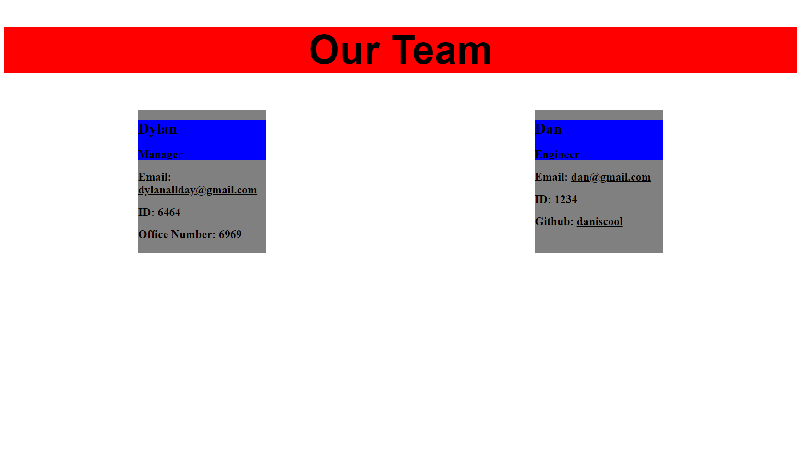

# Team OG

## What is Team OG
Team OG is the new way of organizing your team. It holds their basic information like email, role, and github.

## Installation
Download the file from GitHub and run "npm install".

## Check it out

## Watch this walkthrough video!
https://drive.google.com/file/d/1HNlD8JrPTHJykw9TL5X7xcloRfCKcRnT/view

## Contribution 
Made with ❤️ by James Killelea
